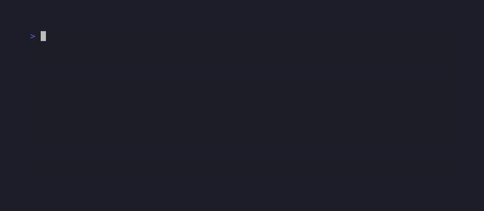

<div align="center">

[](https://github.com/BartoszOsiej/TeleWiedza/pkgs/container/teleinformatyka-wikipedia)
[](https://bartoszosiej.github.io/teleinformatyka-wikipedia/)


[](LICENSE)
[](https://scorecard.dev/viewer/?uri=github.com/BartoszOsiej/TeleWiedza)

**Kompleksowa encyklopedia wiedzy teleinformatycznej — po polsku i angielsku.**

> *Kompletny przewodnik po wszystkim, co może wymagać zawód teleinformatyka —
> od podstaw sieci po zaawansowaną architekturę 5G.*

**→ [bartoszosiej.github.io/teleinformatyka-wikipedia](https://bartoszosiej.github.io/teleinformatyka-wikipedia/)**

</div>

## 📺 Demo


<!-- VHS auto-rendered — run: vhs demos/teleinfo.tape -->





## 📖 Co znajdziesz w tej encyklopedii

| Sekcja | Tematy |
|--------|--------|
| 🌐 **Sieci komputerowe** | Model OSI, TCP/IP, adresowanie, routing, switching, DNS/DHCP |
| 📡 **Telekomunikacja** | PSTN, ISDN, VoIP, SIP, SDH/SONET, multipleksacja, QoS |
| 💡 **Światłowody** | Podstawy, kable, testowanie OTDR, WDM/DWDM, spajanie |
| 📶 **Bezprzewodowe** | WiFi (802.11a/b/g/n/ac/ax), LTE/4G, 5G NR, mikrofale |
| 🔐 **Bezpieczeństwo** | Firewalls, VPN, szyfrowanie, IDS/IPS, zero trust |
| 📋 **Protokoły** | HTTP/HTTPS, BGP/OSPF, SNMP/NETCONF, MPLS/VPN |
| 🛠️ **Narzędzia** | Wireshark, Nmap, pfSense, monitoring |
| 🎓 **Certyfikaty** | Cisco (CCNA/CCNP/CCIE), CompTIA, Juniper, cloud |
| 🎯 **Scenariusze** | Projektowanie, troubleshooting, migracja, remote work |

<details>
<summary><b>🇬🇧 English summary</b></summary>

**Comprehensive teleinformatics knowledge encyclopedia — in Polish and English.**

A complete guide to everything a telecommunications engineer might need in
their work — from networking basics to advanced 5G architecture.

Documentation structure:

```
docs/
├── networking/          # OSI, TCP/IP, routing, switching
├── telecom/             # VoIP, SIP, SDH, QoS
├── fiber-optics/        # OTDR, WDM, splicing
├── wireless/            # WiFi, LTE, 5G, antennas
├── security/            # Firewalls, VPN, encryption
├── protocols/           # BGP, OSPF, SNMP, MPLS
├── tools/               # Wireshark, Nmap, pfSense
├── certifications/      # Cisco, CompTIA, Juniper
└── scenarios/           # Design, troubleshooting, migration
```

</details>

<details>
<summary><b>🚀 Quick start & tech stack</b></summary>

```bash
# Local dev
npm install && npm start

# Build
npm run build

# Docker
docker build -t teleinformatyka-wikipedia .
docker run -p 3000:80 teleinformatyka-wikipedia
```

| Layer | Tech |
|-------|------|
| Framework | Docusaurus 3.10 |
| Language | TypeScript |
| Deployment | GitHub Pages + Docker/GHCR |
| i18n | Polish (default) + English |

</details>

---

<div align="center">

**Part of [BartoszOsiej](https://github.com/BartoszOsiej)'s portfolio**

MIT © 2026 Bartosz Osiej

</div>
